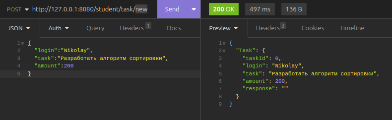

<h1>Тестовое задание для компании SoftWeather</h1>

<h3>Проблема</h3>

В ходе работы зачастую приходится искать нестандартные и оптимизированные пути решения задач. Этим тестовым заданием мы хотим оценить твое умение выполнять задачу, имея неполные данные о ней, а также умение самостоятельно принимать решения и соблюдать качество кода, поэтому пиши код так, как бы ты его писал, работая над энтерпрайз проектом.

Представим, что у ты учишься в университете на программиста, и к тебе постоянно обращаются люди с учебного потока, которые ничего не понимают в алгоритмах, с просьбой помочь им с решением за деньги. В один прекрасный день тебе пришла в голову идея, что надо создать приложение, которое делало бы за тебя всю работу, а тебе оставалось только собирать деньги с обратившихся к тебе людей.
<h3>Задача</h3>

Реализовать сервис, который предоставляет следующий функционал:
1. Создание нового студента, используя его ФИО, номер группы, а также email, например, Штирлиц Иван Васильевич ИП-394 vasya@mail.ru. Для удобства дальнейших запросов, каждому пользователю можно присваивать логин, который будет в роли ярлыка для этого студента. 
2. Изменение долга студента (уменьшение и увеличение). Максимальный долг 1000 рублей. При достижении максимального долга, приложение не должно давать ответы на новые запросы решения алгоритмических задач.
3. Получение ответа на алгоритмическую задачу. У каждой задачи есть своя стоимость для получения ответа, поэтому необходимо изменять долг студента, для которого надо получить ответ (не забудь про максимальный долг).

<h3>Инструкция по запуску</h3>
1. Для запуска приложения нужно запустить docker контейнер из папки storage/postgres/docker-compose.yml командой <b>"$ docker-compose -f docker-compose.yml up"</b>b> 
2. Будет запущен контейнер с БД postgres на 5431 порту 
3. В папке cmd/main.go мы запускаем приложение <b>"$ go run main.go"</b>

<h3>Примеры запросов</h3>
<b>/student/new</b> - Запрос создаёт нового пользователя по JSON полям email / fio / number_group и при положительном ответе получаем статус 200 

<b>/student/:login</b> - Запрос который отдаёт пользователя по логину в запросе [Логин получается из почты студента до @] 

<b>/student/task/new</b> - Запрос который создаёт новую задачу в таблицу Task и добавляет её стоимость к долгу студента 

<b>/student/task/:id</b> - Post запрос который отправляет решение задачи и отдаёт статус 200 

<b>/student/task/:id</b> - Get запрос который отдаёт задачу по её id в запросе 

